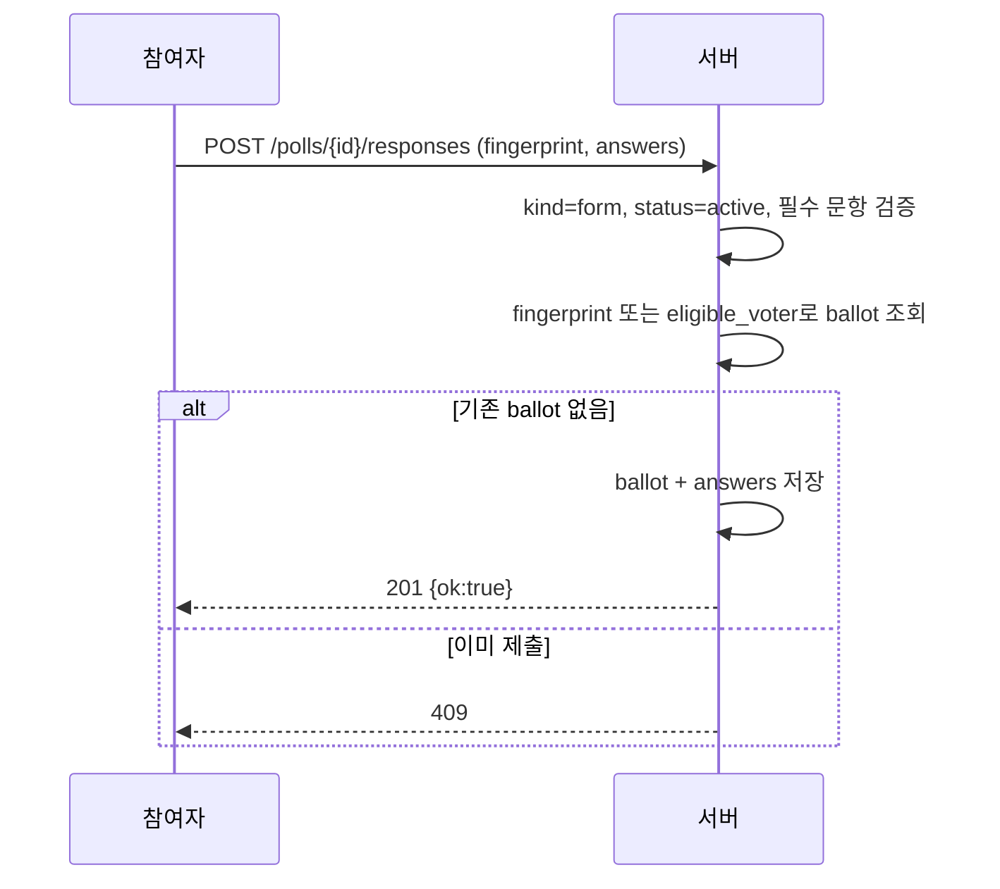
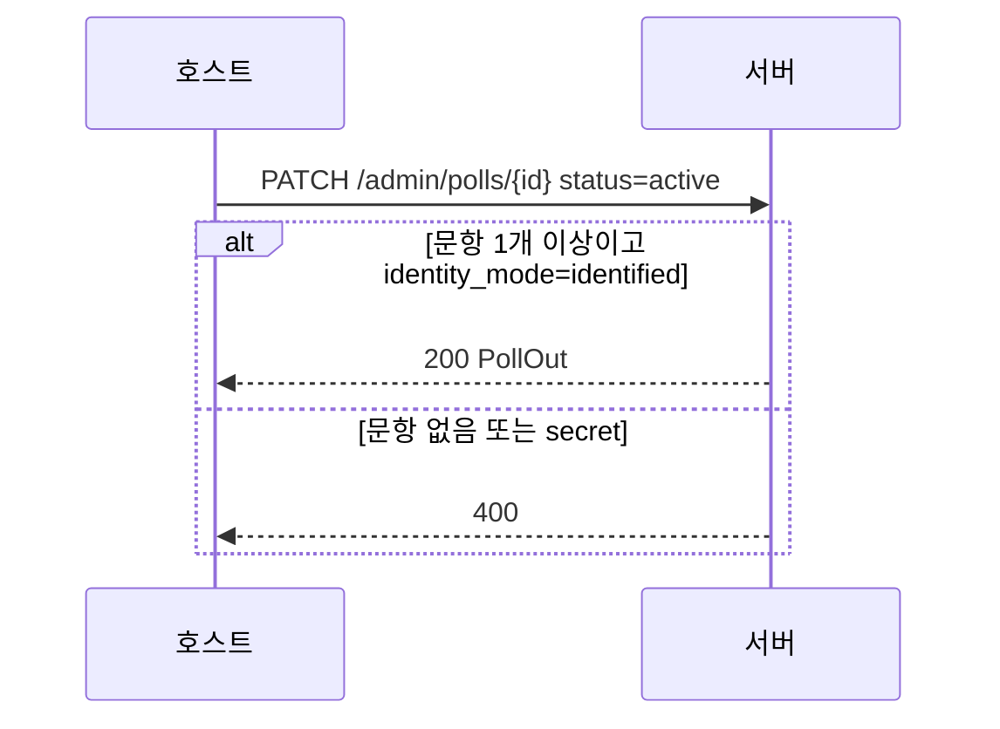

<!-- AI 지시문: 기능요청서 + 인터페이스 정의를 입력으로 작성하라. 3페이지 상한. 구현 코드를 쓰지 말고 구현이 따라갈 결정만 써라. 이 문서가 바이브코딩의 입력이다. -->
# 기술스펙_인터뷰폼

- 기능요청: [#1](https://github.com/MEV-SW/vote-server/issues/1) / 인터페이스 정의: [API스펙_인터뷰폼](https://github.com/MEV-SW/vote-server/blob/main/docs/기능/1-인터뷰폼/API스펙_인터뷰폼.md)
- 작성: 채윤성 / 승인: 없음 (기술스펙은 본인 머지)

## 변경 범위
- `polls`: `kind=form` 생성·조회. 폼은 `identity_mode=identified`로 고정. 후보는 빈 배열.
- 문항·보기 CRUD, 응답 제출·중복 확인, 공개/관리 집계·CSV.
- 기존 순위 투표 경로(`kind=vote`)는 유지. 인증·소유권·Keycloak·무기명 토큰은 이 카드에서 바꾸지 않는다.

## DB 스키마 변경분
- Alembic 번호 없음. 기동 시 `create_all`로 새 테이블, `ensure_schema`로 `polls` 컬럼을 추가한다. 기존 행은 default로 `kind=vote`.
- `polls.kind` VARCHAR(20) NOT NULL DEFAULT `vote`.
- `polls.identity_mode` VARCHAR(20) NOT NULL DEFAULT `secret`. 폼 생성 시 서버가 `identified`로 넣는다. 폼을 `secret`으로 PATCH하면 400.
- 테이블 `questions`: `poll_id` FK CASCADE, `title`, `help_text` nullable, `type`, `required` default true, `order_num`, `scale_min` default 1, `scale_max` default 5.
- 테이블 `question_options`: `question_id` FK CASCADE, `label`, `order_num`.
- 테이블 `answers`: `ballot_id`·`question_id` FK CASCADE, `text_value` nullable, `scale_value` nullable. UNIQUE(`ballot_id`,`question_id`).
- 테이블 `answer_options`: `answer_id`·`option_id` FK CASCADE. UNIQUE(`answer_id`,`option_id`).
- 폼 응답은 기존 `ballots` 행에 붙인다. 불특정은 fingerprint, 특정은 `eligible_voter_id`로 한 사람 한 표. `vote_items`는 쓰지 않는다.

## 핵심 흐름 (시퀀스 1-2개)
- `type`: `short_text` | `long_text` | `single_choice` | `multi_choice` | `scale`. 객관식은 보기 2개 이상. 척도는 min < max.
- draft→active는 문항 1개 이상. 공개 집계는 closed만, `responses`와 주관식 `texts`는 비운다. 관리 집계는 개별 응답을 포함한다.

## 외부 의존성
- vote-web이 이 API를 쓴다. 새 외부 서비스 없음. FastAPI·SQLAlchemy 기존 스택.

## flag
- 없음. OFF 동작 없음.
