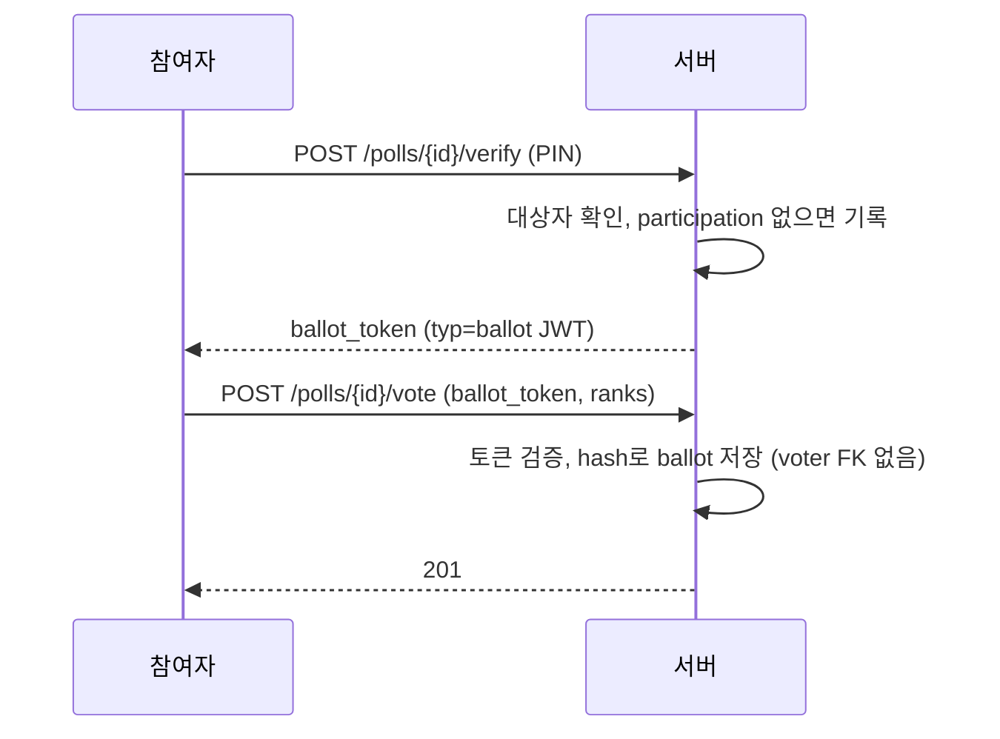
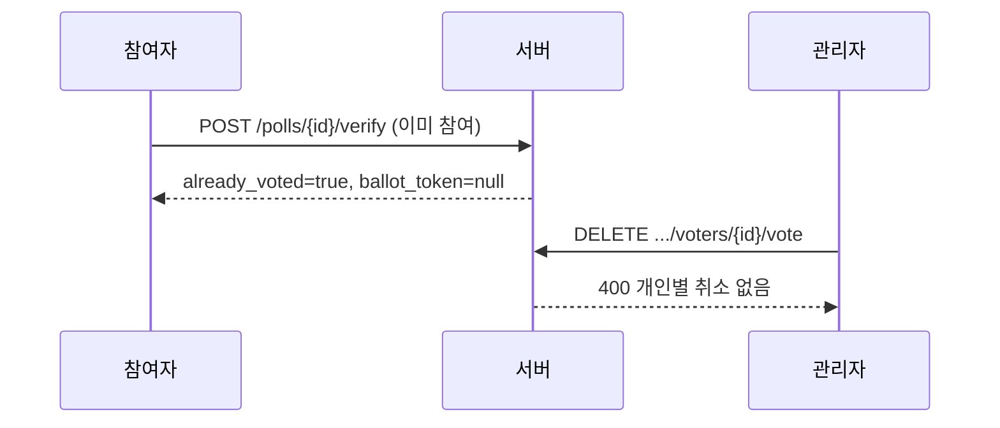

<!-- AI 지시문: 기능요청서 + 인터페이스 정의를 입력으로 작성하라. 3페이지 상한. 구현 코드를 쓰지 말고 구현이 따라갈 결정만 써라. 이 문서가 바이브코딩의 입력이다. -->
# 기술스펙_무기명투표

- 기능요청: [#2](https://github.com/MEV-SW/vote-server/issues/2) / 인터페이스 정의: [API스펙_무기명투표](https://github.com/MEV-SW/vote-server/blob/main/docs/기능/2-무기명/API스펙_무기명투표.md)
- 작성: 채윤성 / 승인: 없음 (기술스펙은 본인 머지)

## 변경 범위
- `identity_mode=secret`인 제한 투표의 자격 증명과 표 저장. 폼은 기명 유지.
- `verify`(PIN), `check`, `vote`, 관리 결과·개인 취소. Keycloak SSO 검증 엔드포인트는 [#3](https://github.com/MEV-SW/vote-server/issues/3).
- 순위 집계 공식은 변경 없음.

## DB 스키마 변경분
- Alembic 번호 없음. `create_all` + `ensure_schema`.
- `ballots.ballot_token_hash` VARCHAR(64) nullable. 무기명 표만 채운다. `eligible_voter_id`는 넣지 않는다.
- 테이블 `participations`: `poll_id` FK CASCADE, `idp_sub_hash` VARCHAR(64), UNIQUE(`poll_id`,`idp_sub_hash`). 표·후보 FK 없음.
- 해시는 HMAC-SHA256(`SECRET_KEY`, `{poll_id}:{subject}`). PIN 대상자는 `pin:{eligible_voter_id}`.

## 핵심 흐름 (시퀀스 1-2개)

## 외부 의존성
- vote-web이 `ballot_token`을 세션에 두고 제출한다. 새 외부 서비스 없음.

## flag
- 없음. OFF 동작 없음.
