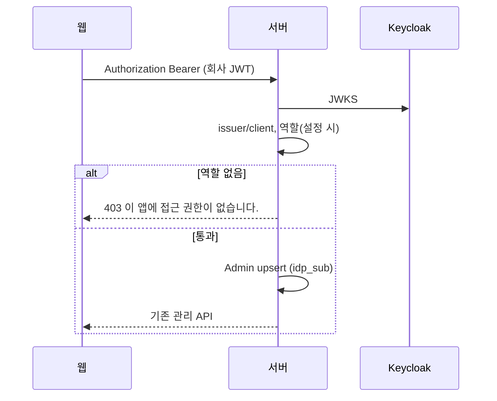
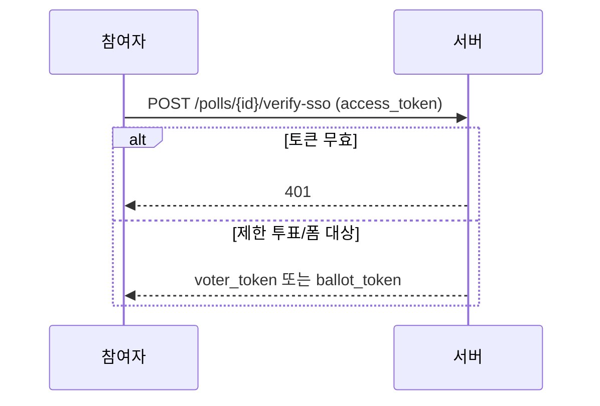

<!-- AI 지시문: 기능요청서 + 인터페이스 정의를 입력으로 작성하라. 3페이지 상한. 구현 코드를 쓰지 말고 구현이 따라갈 결정만 써라. 이 문서가 바이브코딩의 입력이다. -->
# 기술스펙_Keycloak앱접근

- 기능요청: [#3](https://github.com/MEV-SW/vote-server/issues/3) / 인터페이스 정의: [API스펙_Keycloak앱접근](https://github.com/MEV-SW/vote-server/blob/main/docs/기능/3-Keycloak/API스펙_Keycloak앱접근.md)
- 작성: 채윤성 / 승인: 없음 (기술스펙은 본인 머지)

## 변경 범위
- 회사 JWT로 `/admin/*` 접근. `GET /admin/auth/config`. `POST /polls/{id}/verify-sso`.
- `KEYCLOAK_ADMIN_ROLE`은 앱 접근 게이트다. 전역 투표 관리 권한이 아니다. 소유권은 [#4](https://github.com/MEV-SW/vote-server/issues/4).
- 로컬 로그인 경로(`AUTH_MODE=local`)는 유지.

## DB 스키마 변경분
- Alembic 번호 없음. `ensure_schema`.
- `admins.idp_sub` VARCHAR(200) nullable. 회사 `sub`로 Admin 행을 찾거나 만든다.
- `eligible_voters.idp_sub` VARCHAR(200) nullable. SSO 자격 확인 시 대상자 매칭. UNIQUE(`poll_id`,`idp_sub`)는 값이 있는 행만.

## 핵심 흐름 (시퀀스 1-2개)

## 외부 의존성
- Keycloak JWKS `issuer/protocol/openid-connect/certs`. `python-jose` RS256. vote-web OIDC 클라이언트.

## flag
- 없음. `AUTH_MODE`와 issuer/client_id 비우면 OIDC 경로가 꺼지고 로컬만 남는다.
