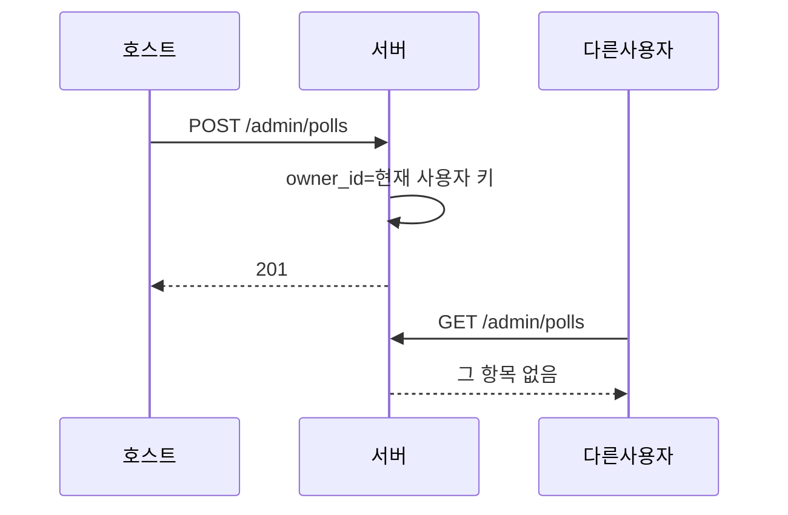
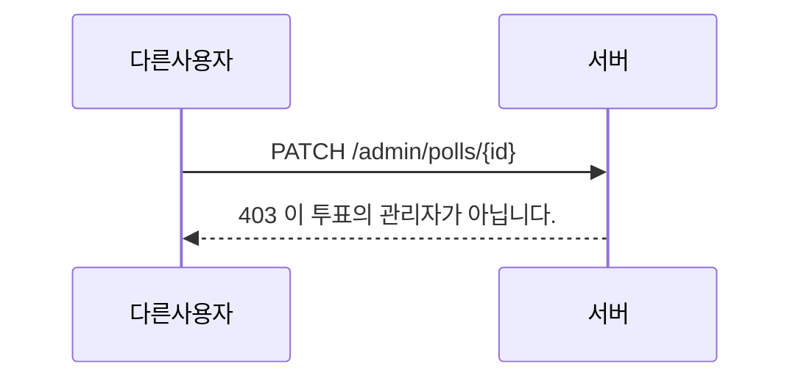

<!-- AI 지시문: 기능요청서 + 인터페이스 정의를 입력으로 작성하라. 3페이지 상한. 구현 코드를 쓰지 말고 구현이 따라갈 결정만 써라. 이 문서가 바이브코딩의 입력이다. -->
# 기술스펙_생성자소유권

- 기능요청: [#4](https://github.com/MEV-SW/vote-server/issues/4) / 인터페이스 정의: [API스펙_생성자소유권](https://github.com/MEV-SW/vote-server/blob/main/docs/기능/4-소유권/API스펙_생성자소유권.md)
- 작성: 채윤성 / 승인: 없음 (기술스펙은 본인 머지)

## 변경 범위
- 생성 시 `owner_id`/`owner_name`. 목록은 내 것만. 수정·결과·삭제·문항 등은 소유자만.
- 회사 사용자의 `owner_id`는 IdP `sub`. 로컬은 `local:{username}`.
- 전역 슈퍼관리자 없음. 구 행(`owner_id` null)은 로컬 로그인만 관리.

## DB 스키마 변경분
- Alembic 번호 없음. `ensure_schema`.
- `polls.owner_id` VARCHAR(200) nullable.
- `polls.owner_name` VARCHAR(200) nullable.

## 핵심 흐름 (시퀀스 1-2개)

## 외부 의존성
- [#3](https://github.com/MEV-SW/vote-server/issues/3)의 회사 `sub`. vote-web 관리 화면이 403을 목록으로 돌린다.

## flag
- 없음. OFF 동작 없음.
