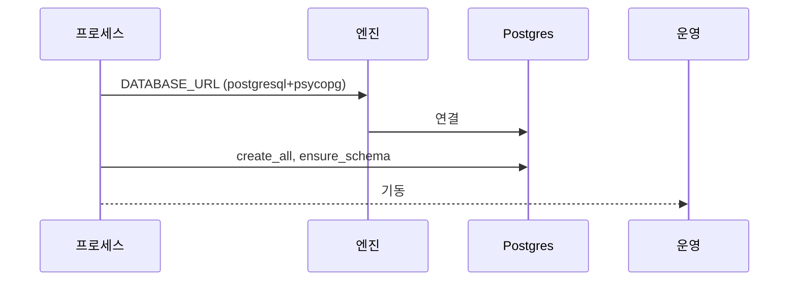
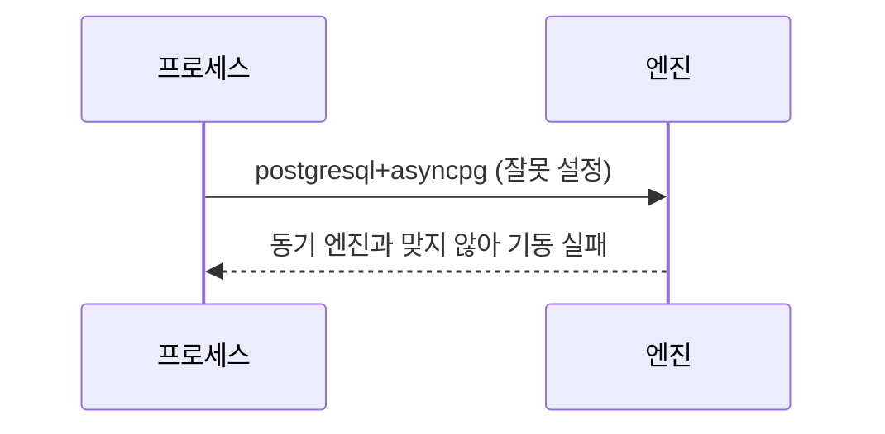

<!-- AI 지시문: 기능요청서 + 인터페이스 정의를 입력으로 작성하라. 3페이지 상한. 구현 코드를 쓰지 말고 구현이 따라갈 결정만 써라. 이 문서가 바이브코딩의 입력이다. -->
# 기술스펙_Postgres연결

- 기능요청: [#5](https://github.com/MEV-SW/vote-server/issues/5) / 인터페이스 정의: [API스펙_Postgres연결](https://github.com/MEV-SW/vote-server/blob/main/docs/기능/5-Postgres/API스펙_Postgres연결.md)
- 작성: 채윤성 / 승인: 없음 (기술스펙은 본인 머지)

## 변경 범위
- 동기 `create_engine` + `psycopg`(binary). `DATABASE_URL` 예시를 Postgres로 문서화.
- SQLAlchemy 모델·라우터 변경 없음. asyncpg/`create_async_engine` 전환 없음.
- `public` CREATE 권한은 앱이 부여하지 않는다.

## DB 스키마 변경분
- 없음. 기존 `create_all`/`ensure_schema`가 Postgres에서도 돈다.

## 핵심 흐름 (시퀀스 1-2개)

## 외부 의존성
- Postgres. `psycopg[binary]`. vote-web 변경 없음.

## flag
- 없음. URL이 sqlite면 기존처럼 SQLite로 뜬다.
